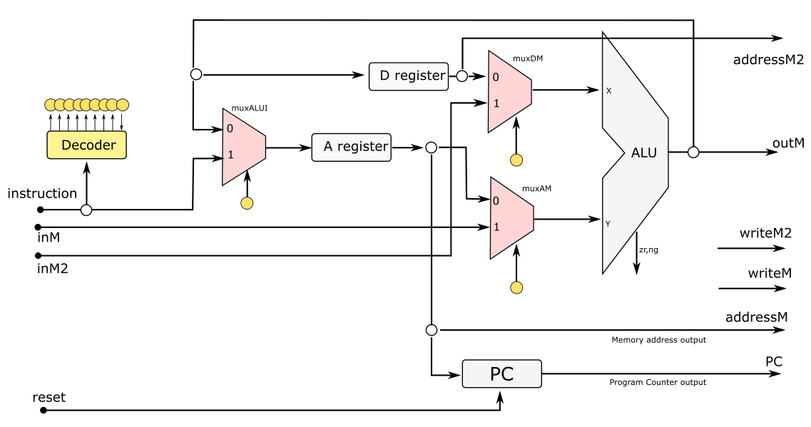

# Av3 - 2° Semestre de 2024


Avaliação 3 - Elementos de Sistemas

| Pontos HW | Pontos SW |
|:---------:|:---------:|
| 20        | 80        |

- Avaliação **individual**.
- **120 min** total.
- Ficar no blackboard durante a prova.
- Clonar o seu repositório (e trabalhar nele)
- Fazer **commit** ao final de cada questão.
- Lembre de dar **push** ao final.


A questão de Assembly (`.nasm`) devem ser implementadas nos arquivos localizados na pasta `src/nasm`, a questão de VM (`vm`) devem ser implementadas nos arquivos localizados em `src/vm`. 

Não há testes para a parte de HW.


**LEMBRE DE REALIZAR UM COMMIT (A CADA QUESTÃO) E DAR PUSH AO FINALIZAR**

## 1. Assembly - roll


| Pontos HW | Pontos SW |
|:---------:|:---------:|
| 0         | 30        |

Faça um programa em Assembly que realize uma operação de rolagem de um vetor de 5 elementos começando na posição RAM[15]. Isto é, o valor da RAM[15] deve ser passado para a RAM[16], o valor anterior da RAM[16] para a RAM[17], o valor anterior da RAM[17] para a RAM[18], o valor anterior da RAM[18] para a RAM[19], o valor anterior da RAM[19] para a RAM[15].

    
#### Exemplo 1:

Representação na memória:
```
RAM[15]  ="0000000000000100"
RAM[16]  ="0000000000000111"
RAM[17]  ="0000000000001010"
RAM[18]  ="0000000000001011"
RAM[19]  ="1100000000001011"
RAM[20]  ="1000000000001011"
```
Resultado:
```
RAM[15]  ="1100000000001011"
RAM[16]  ="0000000000000100"
RAM[17]  ="0000000000000111"
RAM[18]  ="0000000000001010"
RAM[19]  ="0000000000001011"
RAM[20]  ="1000000000001011"
```

### Implementação

Implemente o código Assembly no arquivo `src/nasm/roll.nasm`

Para testar, execute:

```
./compileAssembly.py
pytest --tb=no -k Assembly
```


#### Rubrica para avaliação:

| Pontos SW | Descritivo                                              |
|-----------|---------------------------------------------------------|
| 10        | Demonstrar conhecimento de realização loops em Assembly |
| 10        | Demonstrar conhecimento da realização de condicionais em Assembly            |
| 10        | Demonstrar conhecimento básico de Assembly    |


## 2. VM - PA


| Pontos HW | Pontos SW |
|:---------:|:---------:|
| 0         | 25       |

Faça um código em VM que calcule a soma dos valores do uma Progressão Aritmética, sendo que o último valor da pilha indica a razão, o penúltimo termo indica o número de elementos da série e o antepenúltimo indica o elemento inicial.

    
#### Exemplo:

Supondo que os três últimos valores da pilha sejam:

```
3
4
2 <- último valor da pilha
```

A PA correspondente seria: 3, 5, 7, 9 (iniciando em 3 com 4 elementos e razão de 2).
Assim, ao término da operação, esses três valores deveriam ser retirados da pilha e substituído por 24.

### Implementação

Implemente o código VM na pasta `src/pa/`

Para testar, execute:

```
./compileVM.py
pytest --tb=no -k VM
```

#### Rubrica para avaliação:

| Pontos SW | Descritivo                                                                   |
|-----------|------------------------------------------------------------------------------|
| 10        | Demonstrar conhecimento básico da operações na pilha/vm           |
| 15        | Demonstrar conhecimento da utilização de funções/loop/condicionais            |

## 3. CPU


| Pontos HW | Pontos SW |
|:---------:|:---------:|
| 20        | 0       |


Queremos alterar a estrutura da CPU do nosso computador para poder acessar duas posições de memórias ao mesmo tempo. Para isso, foi incluido o muxDM como indicado na figura, além dos sinais addressM2, inM2 e writeM2.
 




Dessa forma, o formato das instruções, que permanece usando 18 bits, deve ser alterado da seguinte forma:

- na instrução tipo C, o bit 14 (que era mantido em zero no CPU original) passa a representar o sinal de controle do muxDM e o bit 6 passa a representar o salvamento no endereço addressM2.
- as instruções tipo A não são alteradas.

### Questões

Baseado nesta versão do CPU:

1. Determine qual seria o vetor de 18 bits a ser fornecido para a _ControlUnit_ para que o CPU realize uma operação "addw (%A), (%D), %A".
2. Determine qual seria o vetor de 18 bits a ser fornecido para a _ControlUnit_ para que o CPU realize uma operação "orw %D, (%A), (%D)".
3. Seria possível alterar essa CPU sem mudar o tamanho dos bits de instrução para que um valor seja carregado diretamente em %D a partir da instrução? Em caso afirmativo, explique como seria feito. Em caso negativo, explique o porquê.
4. Seria possível realizar diretamente a operação "andw %A,  (%A), (%D)" nessa CPU? Justifique.

Responda a questão no arquivo `src/CPU.txt`.


#### Rubrica para avaliação:

| Pontos HW | Descritivo         |
|-----------|--------------------|
| 5         | Cada item correto. |


## 4. Assembler - CPU modificada


| Pontos HW | Pontos SW |
|:---------:|:---------:|
| 0         | 25        |

Na questão anterior foi proposta uma modificação na CPU de forma a incluir o muxDM. 


Dessa forma, o formato das instruções, que permanece usando 18 bits, deve ser alterado da seguinte forma:

- na instrução tipo C, o bit 14 (que era mantido em zero no CPU original) passa a representar o sinal de controle do muxDM e o bit 6 passa a representar o salvamento no endereço addressM2.
- as instruções tipo A não são alteradas.

Nesta questão, o objetivo é modificar o Assembler para esta nova CPU.

### Implementação

Implemente o **comp()** no arquivo **Code.java** apenas para uma instrução **movw**, considerando **todas** as possíveis combinações que podem ocorrer na CPU modificada.

Implemente o **dest()** no arquivo **Code.java** apenas para uma instrução **movw**, considerando **todas** as possíveis combinações que podem ocorrer na CPU modificada.

### Testes

O teste deve ser executado através do arquivo **CodeTest.java**.


#### Rubrica para avaliação:

| Pontos SW | Descritivo                                                            |
|-----------|-----------------------------------------------------------------------|
| 25               | Funções implementadas e passando nos testes                                  |
| ?         | Implementações incompletas ou incorretas serão analisadas caso a caso |

